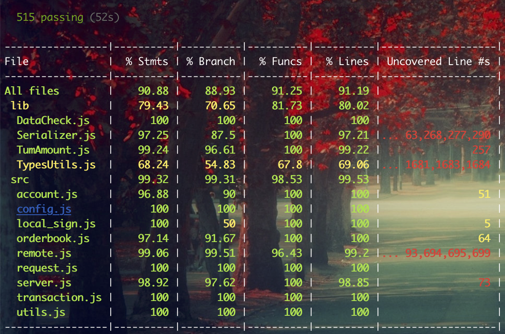

# About JCC Jingtum lib


[](https://travis-ci.com/JCCDex/jcc_jingtum_lib)
[](https://coveralls.io/github/JCCDex/jcc_jingtum_lib?branch=master)
[](http://npm-stat.com/charts.html?package=jcc_jingtum_lib)

Basic js lib to be used for interacting with jingtum & jingtum alliance chains network. Now support browser client.

- Keep only one websocket connection to jingtum and handle exception
- Do transaction to jingtumd, and process response
- Subscribe events, include server, ledger, account and so on
- Get other information from jingtum

原始代码来自[jingtum-lib](https://www.npmjs.com/package/jingtum-lib)，在此基础上[JCCDex团队](https://github.com/JCCDex)做以下增强

The team [JCCDex](https://github.com/JCCDex) made the following enhancements to the code from jingtum

- 支持浏览器 Support running in browsers
- 支持所有的井通联盟链 Support all jingtum alliance chains

井畅应用交流群: 557524730

JCCDex Tech support QQ group ID: 557524730

## INSTALL

```shell
npm install jcc_jingtum_lib
```

## Documents

For more information see [docs.md](https://github.com/JCCDex/jcc_jingtum_lib/blob/master/docs.md)

## About Signature

```javascript
// demo
const LocalSign = require('jcc_jingtum_lib/src/local_sign');
let tx = {
  Flags: 0,
  Fee: 0.00001,
  Account: 'jpgWGpfHz8GxqUjz5nb6ej8eZJQtiF6KhH',
  TransactionType: 'OfferCreate',
  TakerGets: {
    value: 0.03,
    currency: 'CNY',
    issuer: 'jGa9J9TkqtBcUoHe2zqhVFFbgUVED6o9or'
  },
  TakerPays: 1
}
let seed = {
  seed: "snfXQMEVbbZng84CcfdKDASFRi4Hf"
}
let signature = LocalSign(tx, seed);
```

For more structure of transaction data, see [jcc_exchange](https://github.com/JCCDex/jcc_exchange/blob/master/src/tx.js).

## Clone from github

```shell
git clone https://github.com/JCCDex/jcc_jingtum_lib.git
cd jcc_jingtum_lib
npm install
npm run test
```

You will see this image, enjoy it.


